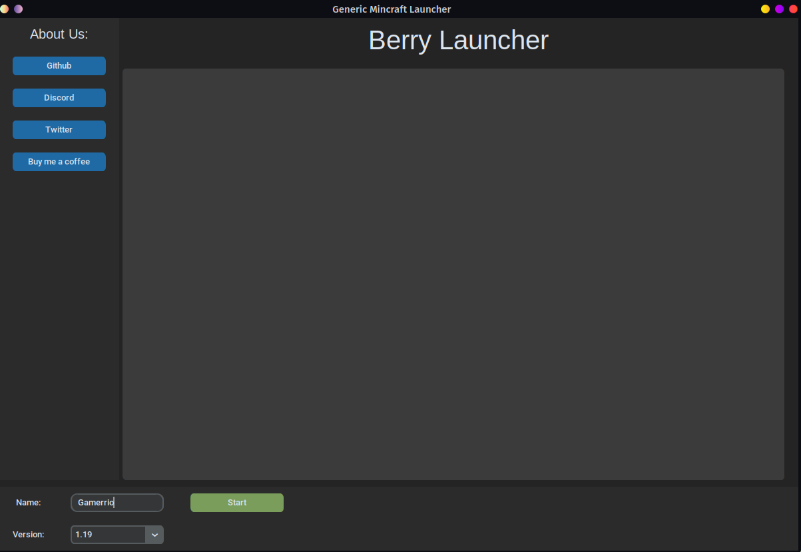

# Berry-Launcher

<p align='center'>
 <br>
<br>


</p>

------
### A Minecraft launcher made in python using [CustomTkinter](https://github.com/TomSchimansky/CustomTkinter)<br><br>


------

## **To Run Source Code:**
> Be sure pip is installed at path (specially if you are on windows)
<br>

```
pip3 install -r requirements.txt
python main.py 
```

------
<br>

## **Installation:**
> *Soon binaries for every platform will be provided*
------

## **Licence:**
[CC0](./LICENSE)